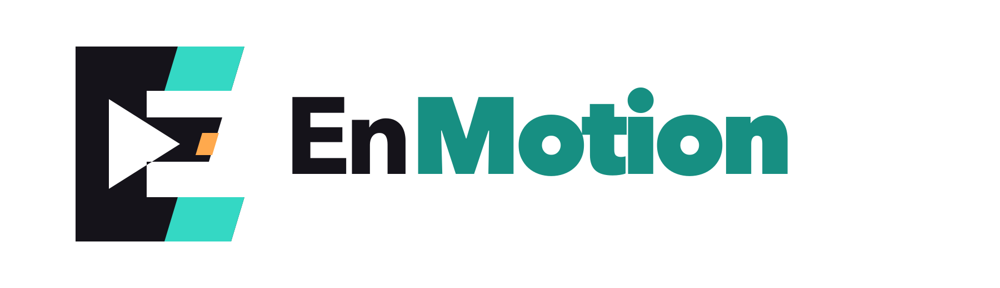

<p align="center">
  
</p>

# EnMotion

EnMotion is a company-managed AI comic and video production application for
macOS and Windows. Creative work and generated media stay on each employee's
computer; a lightweight control plane owns sign-in, company API credentials,
credit balances, rate cards, and audit history. The source repository and
signed desktop installers are public, while application access still requires
an account issued by the company administrator.

## Download EnMotion

Download the latest production installers from the public
[EnMotion GitHub Release page](https://github.com/paulyan678/EnMotion/releases/latest).
No Git checkout, Python, Node.js, or developer tooling is required.

| Computer | Release asset |
|---|---|
| Apple silicon Mac (M1 or newer) | `EnMotion-<version>-macOS-arm64.dmg` |
| Intel Mac | `EnMotion-<version>-macOS-x64.dmg` |
| Windows x64 | `EnMotion-Setup-<version>-Windows-x64.exe` |

The `.app.tar.gz`, `.sig`, `.cdx.json`, `SHA256SUMS`, and
`control-plane-releases.json` files are update or verification artifacts, not
the normal first-install downloads.

## Product shape

- **Desktop:** Tauri 2 shell, statically exported Next.js UI, and a local
  FastAPI/Python sidecar.
- **Local processing:** projects, previews, FFmpeg, Demucs, images, and videos.
- **Control plane:** FastAPI, SQLite WAL, static admin UI, Caddy, and systemd.
- **Updates:** signed, non-blocking macOS and Windows updates built from the
  same public GitHub Release and authorized through the authenticated control
  plane.

Linux is not a supported desktop target. AlmaLinux is supported only for the
small control-plane server.

## Data locations

Generated work defaults to:

```text
<Documents>/enmotion-output/workspaces/<workspace-id>/output/
```

Settings, caches, logs, indexes, and the revocable session refresh token use the
operating system's EnMotion application-data directory. The token is stored in
an EnMotion-only owner-readable file, never in project files, browser
localStorage, or `AGENTS.md`. EnMotion does not store the account password.
Application upgrades do not write into the generated-media location.

Set `ENMOTION_OUTPUT_DIR` or use the desktop setting to select a different stable
output root.

## Development

Prerequisites:

- Python 3.11 or 3.12
- Node.js 24.11–24.x LTS
- npm 11
- FFmpeg
- Rust stable and the Tauri prerequisites for desktop packaging

Install and verify the existing application layers:

```bash
python3 -m venv .venv
.venv/bin/python -m pip install -r requirements.txt -r requirements-dev.txt
npm ci
npm --prefix frontend ci
.venv/bin/python -m pytest
npm --prefix frontend run test:all
npm --prefix frontend run typecheck
npm --prefix frontend run lint
npm --prefix frontend run build
```

Run the lightweight control plane locally:

```bash
cd control_plane
python3 -m venv .venv
.venv/bin/pip install -r requirements-dev.txt
.venv/bin/python scripts/local_setup.py
.venv/bin/uvicorn app.main:app --env-file .local/control.env \
  --host 127.0.0.1 --port 18787
```

Run the browser development harness against it:

```bash
npm run dev
```

This development launcher preserves the fast browser debugging workflow. The
production sidecar is started only by the Tauri shell; it is not a standalone
public server. Native desktop build and release commands are documented in
[`desktop/README.md`](desktop/README.md). Server deployment is documented in
[`control_plane/README.md`](control_plane/README.md).

## Security boundaries

- Employee clients never receive company provider API keys.
- Billable calls are authorized and charged by the control plane.
- Provider endpoints and models are allowlisted server-side.
- Credit mutations are append-only integer ledger entries.
- A missing or revoked control-plane session blocks new billable calls while
  leaving local editing available.
- The local sidecar binds only to a random loopback port and requires a
  per-launch nonce.

Never commit `.env` files, signing keys, provider credentials, release tokens,
databases, generated media, or user configuration.

## Documentation

- [Architecture](docs/ARCHITECTURE.md)
- [Conversion and acceptance plan](docs/CONVERSION_PLAN.md)
- [User manual](USER_MANUAL.md)
- [Model onboarding](docs/model-onboarding-implementation.md)

## License

[MIT](LICENSE). Existing copyright and third-party attribution are preserved.
